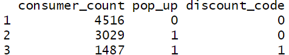
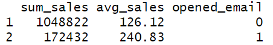

# Online Retailer-- SQL Case-Study
This case study analyzes customer behavior and campaign effectiveness for PopRunner, an online retailer. The analysis uses SQL queries executed via R (sqldf) and focuses on demographic segmentation, purchase behavior, and marketing campaign performance.


## Table of Contents

- Data Preview of tables
- Consumer & purchase summary metrics
- Campaign analyses (pop-up & email)
- Nested-query examples (min/max spenders)
- Key business insights
- Business recommendations

## 1 — Data Preview of tables

### Q1 - 4. Show first 5 rows of the consumer, pop_up, purchase and email table

## Consumer Table
```sql
SELECT *
FROM consumer
LIMIT 5;
```


This output validates the consumer table's schema and confirms presence of key demographic columns (consumer_id, gender, age, and loyalty_status). Verifying schema upfront prevents join and aggregation errors later.

## Pop Up Table
```sql
SELECT *
FROM pop_up
LIMIT 5;
```


The pop_up preview confirms campaign exposure fields such as consumer_id, pop_up (1/0), and saved_discount. These columns are essential to evaluate the effectiveness of pop-up promotions.

## Purchase Table
```sql
SELECT *
FROM purchase
LIMIT 5;
```


The purchase table contains transaction-level records (consumer_id, sales_amount_total) needed for revenue analysis.

## Email Table
```sql
SELECT *
FROM email
LIMIT 5;
```


The email table provides email campaign metrics (consumer_id, opened_email), enabling measurement of campaign response.


## 2 — Consumer & Purchase Summary Metrics

### Q5. Gender distribution and average age

```sql
SELECT COUNT(*) AS gender_count,
       ROUND(AVG(age), 2) AS average_age,
       gender
FROM consumer
GROUP BY gender;
```


**Answer:**
Customer base is 76.4% female (6,903) vs 23.6% male (2,129) with similar average ages: females 31 years, males 32 years. Marketing should prioritize female-focused messaging with age-neutral content targeting the low 30s year demographic.

### Q6. Loyalty status distribution and average age

```sql
SELECT COUNT(*) AS loyalty_count, ROUND(AVG(age)) AS average_age, loyalty_status
FROM consumer
GROUP BY loyalty_status;
```


**Answer:**
Tier 2 leads with 2,612 customers (29% of base). Age increases with loyalty: Tier 0 (29 years) to Tier 4 (34 years), indicating older customers have higher brand loyalty. Target retention efforts at 30+ demographic while focusing acquisition on younger segments.


## 3 — Campaign Effectiveness

### Q7. Pop-up message impact on discount code adoption

```sql
SELECT COUNT(*) AS consumer_count, pop_up AS pop_up, saved_discount AS discount_code
FROM pop_up
GROUP BY pop_up, saved_discount;
```



**Answer:**
Among consumers who received pop-ups, 1,487 saved discount codes compared to 0 who saved codes without receiving pop-ups. Pop-up recipients showed a 33% discount adoption rate (1,487 out of 4,516), while non-recipients had 0% adoption, demonstrating pop-ups effectively drive discount engagement.

### Q8. Pop-up campaign effectiveness analysis

```sql
SELECT SUM(sales_amount_total) AS sum_sales,
       ROUND(AVG(sales_amount_total), 2) AS avg_sales,
       pop_up
FROM purchase p
JOIN pop_up pu ON p.consumer_id = pu.consumer_id
GROUP BY pop_up;
```


**Answer:**
Pop-up campaigns show negative ROI. No pop-up group: $626,325 total sales, $138.69 average. Pop-up group: $594,930 total sales, $131.74 average. Pop-ups reduced spending by $6.95 per customer (-5.0%), suggesting discount offers cannibalized higher-value purchases.

### Q9. Email campaign effectiveness analysis

```sql
SELECT SUM(p.sales_amount_total) AS sum_sales,
       ROUND(AVG(p.sales_amount_total), 2) AS avg_sales,
       e.opened_email
FROM purchase p
JOIN email e ON p.consumer_id = e.consumer_id
GROUP BY e.opened_email;
```



**Answer:** Email campaigns show exceptional ROI. Non-openers: $1,048,822 total, $126.12 average. Email openers: $172,432 total, $240.83 average. Opening emails drives 91% increase in spending (+$114.71), indicating strong targeting effectiveness and high purchase intent among engaged users.


## 4 — Nested Queries / Edge Cases

### Q10. Did the lowest spender receive a pop-up?

```sql
SELECT consumer_id, pop_up
FROM pop_up
WHERE consumer_id = (
    SELECT consumer_id
    FROM purchase
    ORDER BY sales_amount_total
    LIMIT 1
);
```


**Answer:** Lowest spender (ID: 5887286353) did not receive pop-ups (pop_up = 0), suggesting effective targeting that excludes low-value segments or indicates pop-ups don't reach price-sensitive customers.


### Q11. Did the highest spender open the email?

```sql
SELECT opened_email, consumer_id
FROM email
WHERE consumer_id = (
    SELECT consumer_id
    FROM purchase
    ORDER BY sales_amount_total DESC
    LIMIT 1
);
```


**Answer:** Highest spender (ID: 5955534353) opened emails (opened_email = 1), validating the strong correlation between email engagement and high purchase values. Supports prioritizing email marketing for top customer retention.

## 5 — Key Business Insights
### Customer Demographics

- Female-dominant customer base (76.4%) with concentrated age range (30-32 years) suggests focused targeting opportunities
- Progressive age-loyalty correlation indicates older customers (30+) drive higher lifetime value

### Campaign Performance

- Email marketing delivers exceptional ROI with 91% higher spending among engaged users ($240.83 vs $126.12)
- Pop-up campaigns create negative value, reducing average spend by 5% and cannibalizing higher-value purchases
- Pop-up exposure is necessary for discount adoption (33% save rate), but overall campaign impact is negative

### Customer Segmentation

- Email engagement strongly predicts high-value behavior, with top spenders actively engaging with campaigns
- Loyalty tier distribution shows healthy program penetration with tier 2 representing largest segment (29%)

## 6 — Business Recommendations
### Immediate Actions

- Discontinue pop-up campaigns: The -$6.95 per customer impact and revenue cannibalization justify immediate suspension
- Expand email marketing budget: 91% lift in customer value warrants increased investment in email campaigns
- Refine targeting: Focus promotional spend on email-engaged segments rather than broad pop-up distribution

### Strategic Initiatives

- Age-based retention programs: Develop specialized retention tactics for 30+ demographic given loyalty correlation
- Female-focused creative: Align marketing messaging with 76% female customer base preferences
- Loyalty tier optimization: Investigate tier 2 dominance and create progression incentives toward higher tiers

### Performance Monitoring

- Track email open rates as leading indicator of revenue performance
- Monitor discount adoption rates without pop-up interference
- Measure age cohort progression through loyalty tiers to validate retention strategies
